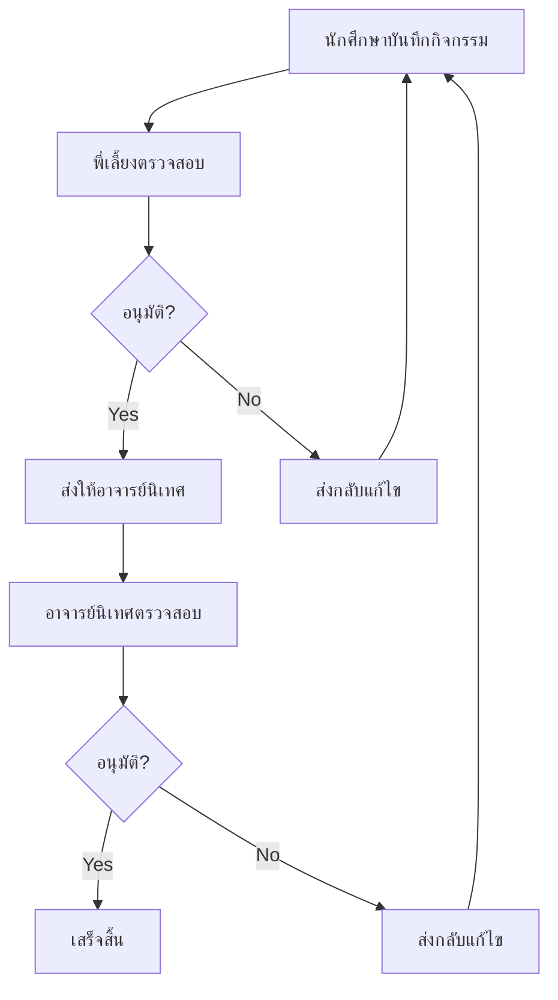

# ระบบฝึกประสบการณ์วิชาชีพ V.1.0.0
## Professional Experience Training System

ระบบจัดการการฝึกประสบการณ์วิชาชีพสำหรับนักศึกษาสาขาเทคโนโลยีคอมพิวเตอร์ พัฒนาด้วย PHP และ MySQL

## 🎯 ภาพรวมของระบบ

ระบบนี้ออกแบบมาเพื่อจัดการและติดตามการฝึกประสบการณ์วิชาชีพของนักศึกษา โดยมีผู้ใช้งาน 3 กลุ่มหลัก:
- **นักศึกษา** - บันทึกกิจกรรมประจำวัน
- **พี่เลี้ยง (Staff)** - ดูแลและอนุมัตินักศึกษา
- **อาจารย์นิเทศ (Auditor)** - ติดตามและประเมินผล

## 🏗️ สถาปัตยกรรมระบบ

```
System Architecture/
├── Frontend (Client-Side)
│   ├── HTML5 (โครงสร้างหน้าเว็บ)
│   ├── Bootstrap 4.2.1 (UI Framework)
│   ├── jQuery 3.4.1 (JavaScript Library)
│   └── FullCalendar 5 (ปฏิทินโต้ตอบ)
├── Backend (Server-Side)
│   ├── PHP (Server-side Logic)
│   └── Session Management
└── Database
    └── MySQL (ฐานข้อมูล 'train')
```

## 📁 โครงสร้างไฟล์

```
project/
├── index.php              # หน้าแรก/Login หลัก
├── main.php               # หน้าหลักนักศึกษา (Calendar)
├── main_staff.php         # หน้าหลักพี่เลี้ยง
├── main_auditor.php       # หน้าหลักอาจารย์นิเทศ
├── logout.php             # ออกจากระบบ
├── include/
│   └── connect.php        # การเชื่อมต่อฐานข้อมูล
├── css/
│   ├── bootstrap-4.2.1.css
│   ├── styles.css
│   └── main.css
├── js/
│   ├── jquery-3.4.1.min.js
│   ├── bootstrap-4.2.1.js
│   └── popper.min.js
└── fullcalendar-5/        # ไลบรารีปฏิทิน
```

## 🔧 เทคโนโลยีที่ใช้

### Frontend
- **HTML5** - โครงสร้างเว็บไซต์
- **Bootstrap 4.2.1** - Responsive UI Framework
- **jQuery 3.4.1** - JavaScript Library
- **FullCalendar 5** - Interactive Calendar
- **AJAX** - การสื่อสารแบบ Asynchronous

### Backend
- **PHP** - Server-side Programming
- **MySQL** - ระบบจัดการฐานข้อมูล
- **Session Management** - จัดการการเข้าใช้งาน

## 👥 ผู้ใช้งานระบบ

### 1. นักศึกษา (Student)
**ฟีเจอร์หลัก:**
- บันทึกกิจกรรมประจำวันผ่านปฏิทิน
- ดูสถานะการอนุมัติจากพี่เลี้ยงและอาจารย์นิเทศ
- แก้ไขข้อมูลส่วนตัวและเปลี่ยนรหัสผ่าน
- ไม่สามารถบันทึกข้อมูลย้อนหลังเกิน 7 วัน

### 2. พี่เลี้ยง (Staff)
**ฟีเจอร์หลัก:**
- เลือกนักศึกษาที่รับผิดชอบ
- อนุมัติและให้ความคิดเห็นกิจกรรมของนักศึกษา
- ประเมินผลการปฏิบัติงาน
- จัดการข้อมูลส่วนตัว

### 3. อาจารย์นิเทศ (Auditor)
**ฟีเจอร์หลัก:**
- ดูแลนักศึกษาในความรับผิดชอบ
- อนุมัติและให้ความคิดเห็นเพิ่มเติม
- ออกรายงานการประเมิน
- จัดการข้อมูลบริษัท/หน่วยงาน
- ดูรายงานข้อมูลนักศึกษา

## 🗄️ โครงสร้างฐานข้อมูล

### ตารางหลัก
```sql
- std_info        # ข้อมูลนักศึกษา
- train_info      # ข้อมูลการฝึกงานรายวัน
- staff_info      # ข้อมูลพี่เลี้ยง
- auditor_info    # ข้อมูลอาจารย์นิเทศ
- office_info     # ข้อมูลบริษัท/หน่วยงาน
```

## ⚙️ การติดตั้งและใช้งาน

### ความต้องการของระบบ
- Web Server (Apache/Nginx)
- PHP 7.0 ขึ้นไป
- MySQL 5.7 ขึ้นไป
- Browser ที่รองรับ HTML5

### ขั้นตอนการติดตั้ง

1. **Clone หรือ Download โปรเจค**
```bash
git clone [repository-url]
cd professional-training-system
```

2. **ตั้งค่าฐานข้อมูล**
```php
// แก้ไขไฟล์ include/connect.php
$hostname = "localhost";
$database = "train";
$username = "root";  
$password = "123456789";
```

3. **สร้างฐานข้อมูล**
- สร้างฐานข้อมูลชื่อ 'train'
- Import โครงสร้างตารางและข้อมูลเริ่มต้น

4. **Deploy บน Web Server**
- วางไฟล์ในโฟลเดอร์ web root
- ตั้งค่า permissions ที่เหมาะสม

## 🔒 ระบบรักษาความปลอดภัย

### การยืนยันตัวตน
- **Session-based Authentication**
- **Remember Me Cookie** (เข้ารหัส)
- **Auto Logout** เมื่อปิด browser

### การป้องกัน
- **SQL Injection** ป้องกันด้วย mysqli prepared statements
- **XSS Protection** ด้วย input validation
- **CSRF Protection** ด้วย session tokens

## 📊 ฟีเจอร์พิเศษ

### 📅 ปฏิทินโต้ตอบ (FullCalendar)
- คลิกวันที่เพื่อบันทึกกิจกรรม
- แสดงสถานะการอนุมัติด้วยสี
- รองรับภาษาไทย
- จำกัดการบันทึกย้อนหลัง (7 วัน)

### 🔄 AJAX Real-time
- บันทึกข้อมูลแบบ Asynchronous
- ค้นหาแบบ Real-time
- Modal dialogs สำหรับ UX ที่ดี

### 📱 Responsive Design
- Bootstrap 4 Framework
- Mobile-friendly interface
- Cross-browser compatibility

## 🎛️ ระบบ Workflow



## 📈 การติดตามและรายงาน

### รายงานที่มี
- **รายงานการประเมิน** - ผลการประเมินของนักศึกษา
- **รายงานข้อมูลนักศึกษา** - สถิติและข้อมูลภาพรวม
- **รายงานกิจกรรมรายวัน** - ความก้าวหน้าของแต่ละคน

## 🚀 การพัฒนาต่อ

### แนวทางปรับปรุง
- เพิ่ม REST API สำหรับ Mobile App
- ระบบแจ้งเตือนผ่าน Email/LINE
- Dashboard สำหรับผู้บริหาร
- ระบบ Export ข้อมูลเป็น PDF/Excel
- Integration กับระบบ LMS

## 🐛 การแก้ไขปัญหา

### ปัญหาที่พบบ่อย
1. **ไม่สามารถเชื่อมต่อฐานข้อมูล**
   - ตรวจสอบการตั้งค่าใน connect.php
   - ตรวจสอบ MySQL service

2. **Session หมดอายุเร็ว**
   - ตรวจสอบการตั้งค่า PHP session
   - ตรวจสอบ server timezone

3. **ปฏิทินไม่แสดง**
   - ตรวจสอบ JavaScript errors
   - ตรวจสอบ FullCalendar library

## 📋 บันทึกการเปลี่ยนแปลง

### Version 1.0.0
- ระบบพื้นฐานสำหรับ 3 กลุ่มผู้ใช้
- ปฏิทินสำหรับบันทึกกิจกรรม
- ระบบอนุมัติแบบ 2 ขั้นตอน
- รายงานพื้นฐาน

## 👨‍💻 ผู้พัฒนา

**Kanokpol Natekuakul**
- สาขาเทคโนโลยีคอมพิวเตอร์
- ระบบจัดการการฝึกประสบการณ์วิชาชีพ


---

**© 2025 Professional Training System - All Rights Reserved**

> ระบบนี้พัฒนาขึ้นเพื่อการศึกษาและใช้งานภายในสถาบันการศึกษา
